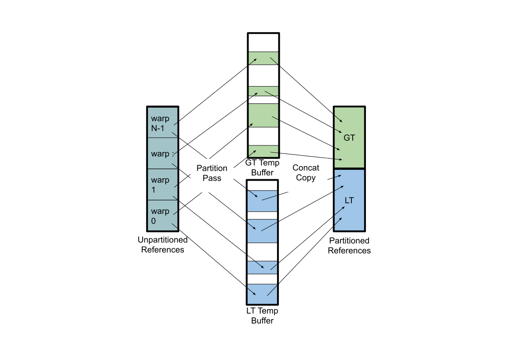

## An Implementation of a Balanced K-D Tree Builder Using GPUs

John Robinson

johnarobinson77@gmail.com

### Overview

A k-d tree is a binary tree that subdivides N-space based on the objects contained in such a space rather than by dividing the space in equal sizes.  Please refer to the [k-d tree](https://en.wikipedia.org/wiki/K-d_tree) article in Wikipedia for a full description.  Described here is an implementation of an algorithm for building k-d trees using GPU described in the paper [Building a Balanced k-d Tree in O(knlogn) Time](http://jcgt.org/published/0004/01/03/) by Russell Brown.  This implementation uses GPUs and is written in Cuda to obtain a substantial speedup over the CPU implementation.  The code for the CPU implementation can be found on the  [Arvix](http://arxiv.org/abs/1410.5420)website.

## Algorithm Overview

In the algorithm presented by Brown, proceeds in the following steps.

1. Given a data set of N tuples of D coordinates each, create and sort D reference arrays according to the coordinate that each array is associated with.  That is, reference array 1 is sorted according to coordinate 1, … reference D is sorted according to coordinate D.
2. Choose the median from the reference array of the first coordinate and then partition the other reference arrays into two arrays where one array has pointers to tuples that are less than and the other has pointers to tuples greater than the chosen median.  The median becomes the key for the first node in the KD tree.  So this tuple should be excluded from the greater than and less than arrays by not placing the equals point.

3. Choose medians from the less than and greater than arrays of second reference array and partition the other arrays around those medians.  These become comparison points for the next two nodes in the KD tree.

4. Repeat 3 in like manner, cycling through the coordinates until all points in the data set have become KD Tree node comparison points.

For the CPU implementation of this algorithm implemented by Brown, Merge Sort was chosen to implement the sort portion of the above algorithm.  For the partitioning part, the CPU implementation uses a recursive subroutine call which chooses the median, partitions the remaining arrays and then calls the same routine, first on the less-than then on the greater-than arrays.  This will be referred to as the depth-first implementation from now on because each branch of the partitioning algorithm proceeds to the bottom before popping up and executing the other branch.  As Brown points out, multithreading this implementation is easily accomplished by sending the available threads down a different branch of the partition until all available threads are fully occupied.

### GPU Implementation

## General Notes

The starting point for this algorithm is an array of data points referred to as tuples.  In this implementation, that data is stored in a &quot;coordinate&quot; array where each tuple is D adjacent coordinates.  The reference arrays are arrays of indices or offsets in tuples from the beginning of the coordinates array.  Using indices instead of pointers makes the translation of the data between host and GPU easier than using pointers without using UVM.  Likewise, the KdNode objects that are the contents of the Kd tree are preallocated in an array, and the references to the less-than and greater-than nodes are indices into that array.  Preallocating the KdNodes can be done because the upper bound on the number of Kd tree nodes is the number of data points.

## GPU Sort

As explained in the overview, the algorithm starts by sorting the reference arrays according to its associated coordinate in the data points.  This section describes this GPU implementation.

## The Compare Function

A reading of the paper by Brown will reveal that the comparison of points used for sorting is more than just a comparison of the coordinate associated with a given reference array.  When the primary coordinates of the two tuples being compared are equal, then the next coordinates are compared.  If these are equal, then the next coordinate is compared, and so on.  The tuples are equal only if all coordinates are equal.

However, when data in the set of tuples can be considered random, the condition where anything other than the primary coordinate of the sort is compared is rare.  This implementation takes advantage of that by creating a temporary value array containing the only the primary coordinate for the sort.  The values are stored in the same relative position as the reference to the tuple it came from.  This value array is used as the main sort key in the sort algorithm and when merging takes place, the primary coordinates and referencee are copied together.  When comparing two tuples the values in the primary array are compared first and only when they are equal does the compare function use the reference to access the next coordinate in the tuple.  What this does is make it so that, for the most part, the sorter is reading adjacent coherent data from global memory, which makes the best use of the available memory bandwidth.

## Merge Sort

For this implementation, the Merge Sort algorithm described in [[Satich, Harris, and Garland](http://mgarland.org/files/papers/gpusort-ipdps09.pdf)], the implementation for which is included in the sample code that is part of the standard Cuda release.  It was chosen for it flexibility and efficiency.  Comparison of the code contained here and the merge sort example in the standard Cuda release code will show that only the following changes have been made.

1. The sort key was replaced by the value array described above.
2. Copies of the binary search functions were added where the compare operator was replaced by a call to the superKeyCompare function that implements the multi coordinate compare described above
3. Small changes were made to allow the sort to work on larger data arrays.

## Remove Duplicates

In some uses of the KD tree, it is necessary to remove duplicate data tuples.  This implementation provides a function to do that on the sorted data.  The value array that is used to accelerate the sort function is also used to accelerate the duplicate removal function.

The remove duplicates function uses a parallel compaction algorithm similar to the one described in the paper by [[Billeter Olsson Assarsson](http://www.cse.chalmers.se/~uffe/streamcompaction.pdf)].  In this case, the compaction performed is to remove adjacent references to tuples that are equal.  Since the reference arrays are sorted, references to equal tuples will be adjacent.

Warp level programming is used to do parallel comparisons of adjacent references. Each active warp removes any duplicates from its assigned segment in the following manner.  The threads in the warp read in 32 consecutive values and references as indexed by the warp thread id. That data is then written to shared memory.  Then each thread compares its value to the next lower index in shared memory.  The result of the compare is first checked to make sure that the current tuple is not less than the lower order, which would indicate that the previous merge sort failed.

Next, the results of that compare are shared with all the other threads in warp through the \_ballot intrinsic command.  The resulting compare mask is a 32-bit number where a 1 indicates the corresponding thread&#39;s compare was greater.  From this, every thread in the warp knows if the other threads are going to write their data.  If the thread&#39;s value is greater than the next lower indexed value, it is rewritten to shared memory, but the location is determined by counting the number of ones in the compare mask between itself and the  0th thread using the \_popc intrinsic command.  That count is added to the output index which indicates where the 0th thread should write its data.  At the end of each iteration, the output index needs to be incremented by the total number of word written by the warp.  This easily computed by counting the total number of ones in the compare mask returned earlier in by the \_ballot command.

Writing the data back to shared memory serves two purposes.  First, it serves as a coalescing buffer for the writes back to global memory.  The shared memory holds two 32-word segments when one of the two 32-word segments is full of unwritten data, that segment is written to global memory.  This coalescing was shown to improve performance by approximately 5%.  The second purpose is to provide a lower index compare value for 0th thread on the next iteration.

Note that each active warp writes it&#39;s section out to global memory independent of the other warps leaving possible gaps between the sections in the global output buffer.  So two passes are required to complete the task.  The first pass that writes out the individual segments to a temporary global buffer and the total number of writes is stored in an array in global memory.  At the beginning of the second pass, reach warp sums the size of all of the lower indexed warps to know where the starting address of this warp&#39;s data, and then copies the data from the temporary buffer back the destination buffer.

### Differences from the Compaction Algorithm Paper

The original paper describes a two-pass algorithm where the first pass counts the compares to get the total number of remaining elements per segment.  The second pass redoes the compare, this time writing the results to the second buffer starting at the place indicated by the first pass.  In this implementation, the data is written to a temporary buffer on the first pass and copied to the final buffer on the second pass. More data movement is required, but the compare only needs to be done once.

Another minor difference is that the coalescing scheme implemented here uses masking of the output address to avoid some of the conditional statements in the original paper.  The only conditional is whether a portion of the buffer needs to be written to global memory.

## Partitioning

As described earlier, building the tree from the sorted arrays requires picking a median from one of the sorted coordinate reference arrays and then partition the other arrays about that median.  The median is a trivial operation, but partitioning like the sorting and duplicates removal, it requires a lot of data movement.  That implementation is described here.

At the lowest level, the partitioner uses the same compaction algorithm as the duplicate removal function described earlier. In this case, a warp reads in 32 references and does the compare to the tuple that is the partitioning value.  As a result of the compare, the reference is written to one of two output buffers, one for greater than, one for less than.  (See Figure 1)  The address in those output buffers is determined using the same method of sharing the compare results the\_ballot intrinsic and counting the number of ones using the \_popc intrinsic.

#### FIgure 1.  Single Pass Partitioning Process

This partitioning algorithm is essentially doing two compaction algorithms simultaneously.  A less memory-intensive way would be to run the two compactions sequentially rather than simultaneously.  But by doing them simultaneously, each running warp outputs the same number of words whether the input data is mostly greater-than or less-than the median.  As a result, the load is balanced across all warps.

The overall tree building algorithm proceeds in breadth-first order, handling the entire level of the tree in sequence.  Each level has twice as many arrays to partition as the preceding level but with half as many elements each  Each level has approximately the same number of references to partition, only reduced by the number taken out for the tree nodes.  With some attention to Cuda details, each level takes about the same amount of time to partition.  In this implementation, four different partitioners or partition kernels are used depending on the level.

The first partitioner handles the upper levels of the tree, where the number of arrays to partition is less than the number of running warps.  This partitioner assigns an equal number of warps to each array to be partitioned and then divides up the array among those assigned warps.  As with the duplicate removal function, each warp copies the compacted data to individual segments in a temporary array.  Then the individual segments are copied back to the source array, compacting out the gaps between the segments.

The second partitioner handles the case where the number of arrays to be partitioned is greater than or equal to the number of active warps.  In this case, the partitioner just divides up the number of arrays to partition, making the warps and each warp loops through those arrays.

At the highest levels of subdivision, the size of the arrays to be subdivided become less than the size of the warp, which is 32.  Below that, using a full warp to subdivide these small arrays is inefficient.  So the third partitioner subdivided the warp by 2, 4, or 8 through appropriate offsetting of the thread id and masking of the compare results from the ballot command.

The fourth partitioner does not actually partition.  At the point where each array only has only 1, 2 or 3 elements, all that needs to be done is to create the leaf nodes of the KD tree. It is the terminating partitioner.  This simple operation is done per-thread rather than per warp.

Note that selection of the above partitioner is done by a comparisons the level, the log2 of the length of the array and the log2 of the number of warps.

- The total number of calls to one of the partitioners is log2(N)
- The number of calls to the first partitioner is log2(N) - log2(warps)
- The number of calls to the second partitioner is log2(warps) - (log2(N) - log2(16)).

log2(n) - log2(16) is the level at which the number of elements to be partitioned is less than 16.

- The third partitioner is only called 3 times when the partition sizes are 16,8 and 4.

- The terminating partitioner is call (obviously) just once.

## Building the KD Tree

The KD Tree algorithm calls for picking a median about the primary array at each level of subdivision and the partitioning the other arrays about that median.  That median becomes a node in the k-d tree and is excluded from future partitioning by the fact that equal values are not copied to either the greater-than or less-than arrays.

In the depth-first recursive algorithm, the building the tree is easily accomplished by the recursive routine creating a node and then adding the pointers returned by the lower level calls.  In the breadth-first iterative algorithm, the tree is built from the top down instead of the bottom up.  Here is how.

When a warp enters the partitioning phase, it chooses the median to partition around.  The reverence to that median is stored in an array based on the partitioning address.  The partition address can be thought of as a trace of the subdivision path it took to get to where the process is at that point.  The most significant bit determined by the first subdivision, 0 for less-than, 1 for greater-than.   The second bit is determined by the less-than / greater-than selection for the second level and so on.  For each level of subdivision, one more bit is added to the address, and the median store that it addresses is twice as long.  There is a separate median store for each level of subdivision.

When addressed in this way, entry k in a storage array for level L can be thought of as a node in the KD tree where the less than or greater than nodes are in median storage for level L+1 at 2\*k and 2\*k+1 respectively.  All of the partitioners create nodes in the tree for each level and then using the data stored in the median storage from the previous level, fills in the less than and greater-than references in the previous level&#39;s nodes.  And then, in turn, fill in a new median storage array to be used in the next partitioner.

It should be noted that the accumulation of the storage arrays is a sufficient and optimized representation of the k-d tree.  However, the k-d tree with nodes and references is built to be compatible with the original CPU version.

## Completion

This completes the building of the Kd Tree.  The code shared here also includes a GPU based tree verifier that is also a breadth-first algorithm and methods to copy the Kd tree and coordinate arrays back to the CPU.  There is also a depth-first CPU side Kd Tree verifier on the CPU side.

## Performance Examples

All of the examples below were run on 16777216 tuples with four dimensions each.

All of the CPU examples were run with 8 threads.

All of the GPU examples were run with 1024 threads in 64 blocks.

CPU version running in  MacBook Pro with a 4-core, 2.2 GHz Intel i7

totalTime = 11.88  initTime = 0.12  sortTime = 5.14  removeTime = 0.42  kdTime = 5.97  verifyTime = 0.22

CPU version running in Win 7 on core i7 running at 3.4 GHz

totalTime = 14.77  initTime = 0.06  sortTime = 7.05  removeTime = 0.55  kdTime = 6.92  verifyTime = 0.19

CPU version running on Amazon Web Services G2 node Ubuntu 14.04

totalTime = 17.79  initTime = 0.05  sortTime = 8.08  removeTime = 0.62  kdTime = 8.86  verifyTime = 0.17

GPU version running on Amazon Web Services G2 node nVida Grid K520 Ubuntu 14.04

totalTime = 2.371  initTime = 0.081  sortTime + removeTime = 0.823  kdTime = 1.365  verifyTime = 0.101

GPU version running on an nVidia Titan Black  Ubuntu 14.04

totalTime = 1.437  initTime = 0.048  sortTime + removeTime = 0.388  kdTime = 0.920  verifyTime = 0.080

### Multiple GPU Extensions

Multiple GPUs in the same compute node have become the norm on large server farms. Described here is a method for extending the process to two GPUs.  Some observations about the original algorithm that allow the cross GPU work to be minimized.  Those observations can be used to extend the process to more than two GPUs but this implementation only handles two.

## Two GPU Sort

Multi GPU sort has been addressed many times, but for this implementation of the KdTree builder, the algorithm of swap and merge described in [[Tanasic et al](http://impact.crhc.illinois.edu/shared/papers/p1-tanasic.pdf).] is particularly well suited. It correctly set up the data for the partitioning phase of the algorithm to be independently executed on the two GPUs, as will be explained in a later section.

First, the tuples in the coordinate array on the CPU are split. One half goes to each of two GPUs that will be referred to as A and B.   A reference array for the first coordinate in the tuple is generated, and the merge sort is performed independently in each GPU.  But at this point, the data is not sorted across GPUs yet.

To be properly sorted across GPUs, all of the data in GPU A needs to be less than all of the data in GPU B.  [Tanasic et a](http://impact.crhc.illinois.edu/shared/papers/p1-tanasic.pdf)l. show us that there is a pivot point where all the below that point in B needs to be swapped with the data above N-pivot in A and it is the point where Atuple[N-Pivot] \&lt; Btuple[pivot] and Atuple[N-Pivot+1] \&gt; Btuple[pivot-1].  This pivot point can be found with a binary search and hence only requires a single thread.  Then as many threads as necessary can be used to perform the swap.  Note that because the bandwidth between GPUs is limited, a single GPU can easily saturate that bandwidth on for the actual data swap so only one GPU is used.

Unlike other operations, the coordinate data is actually swapped, not the references.  For each coordinate that needs to be swapped, the swap routine reads the reference from the A and B reference arrays.  Then the tuple referenced by the A reference is written the location referenced by the B reference and vise versa.  Note that at the end of this process, the tuples are no longer in the same place as they were originally in the array from the CPU, and the references now reference different data than they did originally, but the references remain unique and consistent.

The result of the swap leaves two sub-arrays that are sorted but not with each other, one above the pivot point and one below.  So those two have to be merged.  This implementation uses the Merge Path algorithm described in [[Green, McColl, Bader](http://www.cc.gatech.edu/~bader/papers/GPUMergePath-ICS2012.pdf)].  This algorithm perfectly distributes the work of merging of sorted data among the active threads.  The algorithm is described in several places and so is skipped here.  Of note though is that that this implementation uses the technique described in [[Satich, Harris, and Garland](http://mgarland.org/files/papers/gpusort-ipdps09.pdf)] to accelerate the low-level merge of the independent blocks where the position in the output array of any element can be found by searching for it;s position in the other array and adding that position to its own.

## Refactoring the Kd Tree algorithm for Multiple GPUs

As explained earlier, the basic algorithm is to sort the data D times again each of the D coordinates in the tuple.  Then data for d != n is partitioned against the median for d = n where d cycled from 1..D on each successive partition.  But there is a small speedup that can be made by considering the following optimization.  Consider what data exists after the first partitioning cycle.  A median is chosen from the d=1 sorted data and the data for d = 2..D is partitioned against that into two arrays that are less than and greater than the median.  In the end, all D of the less-than arrays and all D of the greater-than arrays contain exactly the same data, just in a different order.

So the optimization is:

1. Only sort the full data set on the first coordinate
2. Divide the data in half at the median.
3. Copy the less than and greater than references to the other D-1 reference arrays.

4. Sort the less than and greater-than arrays independently.

The above steps put the data in the same state as the original algorithm after the first partitioning steps but does so by doing twice the sorts on half the data and bypasses the partitioning step.

On a CPU or single GPU algorithm, the optimization is minor, but on the two GPU implementation, the benefit is more significant.  The result of the 2-GPU sort described above results in an equal amount of data in each of the 2 GPUs. The data is partitioned exactly with the less-than data on one GPU and the greater-than data on the other GPU.  From that point, the data sorting of the other 2..D reference arrays and the remaining median select and partitioning step can proceed entirely independently on the GPUs.

## Multi-GPU Performance

In one example, running on 2 GPUs was 1.9 times faster the running on just one of the 2 GPUs.  The slowest part of the Two GPU algorithm is swapping coordinates between the 2 GPUS.  The time for that could be significantly reduced by copying the full coordinate array to both GPUs to begin with but at the cost of more memory.
